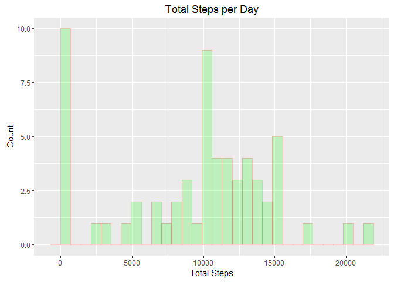
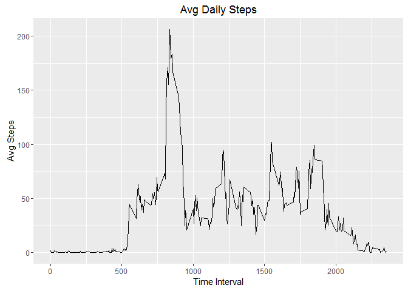
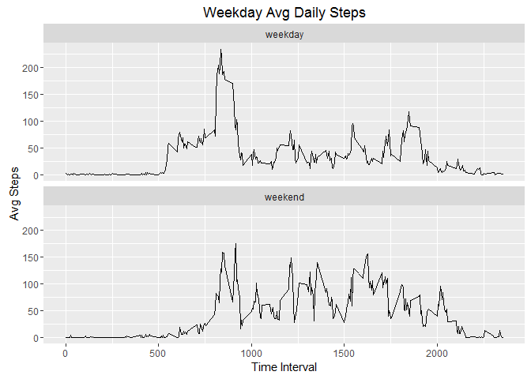

# Reproducible Research: Peer Assessment 1


## Loading and preprocessing the data

The data is unziped and loaded with the following script.  The zip file is assumed to be in your working directory.


```r
require(dplyr, quietly = T, warn.conflicts = F)
require(ggplot2, quietly = T)
require(xtable, quietly = T, warn.conflicts = F)
```

```
## Warning: package 'xtable' was built under R version 3.2.5
```

```r
unzip("activity.zip")
data <- read.csv("activity.csv", stringsAsFactors = F)
```

## What is mean total number of steps taken per day?

```r
stepData <- group_by(data, date)
dailyTotal <- summarize(stepData, n = sum(steps, na.rm = T))
names(dailyTotal) <- c("Date","Steps")
dailyMean <- mean(dailyTotal$Steps)
dailyMedian <- median(dailyTotal$Steps)
```

Total Steps per Day:


```r
print(xtable(dailyTotal), type="html")
```

<!-- html table generated in R 3.2.4 by xtable 1.8-2 package -->
<!-- Thu May 12 09:45:03 2016 -->
<table border=1>
<tr> <th>  </th> <th> Date </th> <th> Steps </th>  </tr>
  <tr> <td align="right"> 1 </td> <td> 2012-10-01 </td> <td align="right">   0 </td> </tr>
  <tr> <td align="right"> 2 </td> <td> 2012-10-02 </td> <td align="right"> 126 </td> </tr>
  <tr> <td align="right"> 3 </td> <td> 2012-10-03 </td> <td align="right"> 11352 </td> </tr>
  <tr> <td align="right"> 4 </td> <td> 2012-10-04 </td> <td align="right"> 12116 </td> </tr>
  <tr> <td align="right"> 5 </td> <td> 2012-10-05 </td> <td align="right"> 13294 </td> </tr>
  <tr> <td align="right"> 6 </td> <td> 2012-10-06 </td> <td align="right"> 15420 </td> </tr>
  <tr> <td align="right"> 7 </td> <td> 2012-10-07 </td> <td align="right"> 11015 </td> </tr>
  <tr> <td align="right"> 8 </td> <td> 2012-10-08 </td> <td align="right">   0 </td> </tr>
  <tr> <td align="right"> 9 </td> <td> 2012-10-09 </td> <td align="right"> 12811 </td> </tr>
  <tr> <td align="right"> 10 </td> <td> 2012-10-10 </td> <td align="right"> 9900 </td> </tr>
  <tr> <td align="right"> 11 </td> <td> 2012-10-11 </td> <td align="right"> 10304 </td> </tr>
  <tr> <td align="right"> 12 </td> <td> 2012-10-12 </td> <td align="right"> 17382 </td> </tr>
  <tr> <td align="right"> 13 </td> <td> 2012-10-13 </td> <td align="right"> 12426 </td> </tr>
  <tr> <td align="right"> 14 </td> <td> 2012-10-14 </td> <td align="right"> 15098 </td> </tr>
  <tr> <td align="right"> 15 </td> <td> 2012-10-15 </td> <td align="right"> 10139 </td> </tr>
  <tr> <td align="right"> 16 </td> <td> 2012-10-16 </td> <td align="right"> 15084 </td> </tr>
  <tr> <td align="right"> 17 </td> <td> 2012-10-17 </td> <td align="right"> 13452 </td> </tr>
  <tr> <td align="right"> 18 </td> <td> 2012-10-18 </td> <td align="right"> 10056 </td> </tr>
  <tr> <td align="right"> 19 </td> <td> 2012-10-19 </td> <td align="right"> 11829 </td> </tr>
  <tr> <td align="right"> 20 </td> <td> 2012-10-20 </td> <td align="right"> 10395 </td> </tr>
  <tr> <td align="right"> 21 </td> <td> 2012-10-21 </td> <td align="right"> 8821 </td> </tr>
  <tr> <td align="right"> 22 </td> <td> 2012-10-22 </td> <td align="right"> 13460 </td> </tr>
  <tr> <td align="right"> 23 </td> <td> 2012-10-23 </td> <td align="right"> 8918 </td> </tr>
  <tr> <td align="right"> 24 </td> <td> 2012-10-24 </td> <td align="right"> 8355 </td> </tr>
  <tr> <td align="right"> 25 </td> <td> 2012-10-25 </td> <td align="right"> 2492 </td> </tr>
  <tr> <td align="right"> 26 </td> <td> 2012-10-26 </td> <td align="right"> 6778 </td> </tr>
  <tr> <td align="right"> 27 </td> <td> 2012-10-27 </td> <td align="right"> 10119 </td> </tr>
  <tr> <td align="right"> 28 </td> <td> 2012-10-28 </td> <td align="right"> 11458 </td> </tr>
  <tr> <td align="right"> 29 </td> <td> 2012-10-29 </td> <td align="right"> 5018 </td> </tr>
  <tr> <td align="right"> 30 </td> <td> 2012-10-30 </td> <td align="right"> 9819 </td> </tr>
  <tr> <td align="right"> 31 </td> <td> 2012-10-31 </td> <td align="right"> 15414 </td> </tr>
  <tr> <td align="right"> 32 </td> <td> 2012-11-01 </td> <td align="right">   0 </td> </tr>
  <tr> <td align="right"> 33 </td> <td> 2012-11-02 </td> <td align="right"> 10600 </td> </tr>
  <tr> <td align="right"> 34 </td> <td> 2012-11-03 </td> <td align="right"> 10571 </td> </tr>
  <tr> <td align="right"> 35 </td> <td> 2012-11-04 </td> <td align="right">   0 </td> </tr>
  <tr> <td align="right"> 36 </td> <td> 2012-11-05 </td> <td align="right"> 10439 </td> </tr>
  <tr> <td align="right"> 37 </td> <td> 2012-11-06 </td> <td align="right"> 8334 </td> </tr>
  <tr> <td align="right"> 38 </td> <td> 2012-11-07 </td> <td align="right"> 12883 </td> </tr>
  <tr> <td align="right"> 39 </td> <td> 2012-11-08 </td> <td align="right"> 3219 </td> </tr>
  <tr> <td align="right"> 40 </td> <td> 2012-11-09 </td> <td align="right">   0 </td> </tr>
  <tr> <td align="right"> 41 </td> <td> 2012-11-10 </td> <td align="right">   0 </td> </tr>
  <tr> <td align="right"> 42 </td> <td> 2012-11-11 </td> <td align="right"> 12608 </td> </tr>
  <tr> <td align="right"> 43 </td> <td> 2012-11-12 </td> <td align="right"> 10765 </td> </tr>
  <tr> <td align="right"> 44 </td> <td> 2012-11-13 </td> <td align="right"> 7336 </td> </tr>
  <tr> <td align="right"> 45 </td> <td> 2012-11-14 </td> <td align="right">   0 </td> </tr>
  <tr> <td align="right"> 46 </td> <td> 2012-11-15 </td> <td align="right">  41 </td> </tr>
  <tr> <td align="right"> 47 </td> <td> 2012-11-16 </td> <td align="right"> 5441 </td> </tr>
  <tr> <td align="right"> 48 </td> <td> 2012-11-17 </td> <td align="right"> 14339 </td> </tr>
  <tr> <td align="right"> 49 </td> <td> 2012-11-18 </td> <td align="right"> 15110 </td> </tr>
  <tr> <td align="right"> 50 </td> <td> 2012-11-19 </td> <td align="right"> 8841 </td> </tr>
  <tr> <td align="right"> 51 </td> <td> 2012-11-20 </td> <td align="right"> 4472 </td> </tr>
  <tr> <td align="right"> 52 </td> <td> 2012-11-21 </td> <td align="right"> 12787 </td> </tr>
  <tr> <td align="right"> 53 </td> <td> 2012-11-22 </td> <td align="right"> 20427 </td> </tr>
  <tr> <td align="right"> 54 </td> <td> 2012-11-23 </td> <td align="right"> 21194 </td> </tr>
  <tr> <td align="right"> 55 </td> <td> 2012-11-24 </td> <td align="right"> 14478 </td> </tr>
  <tr> <td align="right"> 56 </td> <td> 2012-11-25 </td> <td align="right"> 11834 </td> </tr>
  <tr> <td align="right"> 57 </td> <td> 2012-11-26 </td> <td align="right"> 11162 </td> </tr>
  <tr> <td align="right"> 58 </td> <td> 2012-11-27 </td> <td align="right"> 13646 </td> </tr>
  <tr> <td align="right"> 59 </td> <td> 2012-11-28 </td> <td align="right"> 10183 </td> </tr>
  <tr> <td align="right"> 60 </td> <td> 2012-11-29 </td> <td align="right"> 7047 </td> </tr>
  <tr> <td align="right"> 61 </td> <td> 2012-11-30 </td> <td align="right">   0 </td> </tr>
   </table>

Histogram of Total Steps per Day


```r
p <- ggplot(data=dailyTotal, aes(dailyTotal$Steps)) + 
  geom_histogram(col="red", 
                 fill="green", 
                 bins = 30,
                 alpha = .2) + 
  labs(title="Total Steps per Day") +
  labs(x="Total Steps", y="Count")
p
```



Mean Steps per Day : 9354.2295082

Median Steps per Day: 10395


## What is the average daily activity pattern?


```r
dailyData <- group_by(data, interval)
dailyIntervalTotal <- summarize(dailyData, n = mean(steps, na.rm = T))
names(dailyIntervalTotal) <- c("Interval","Steps")
maxSteps <- which.max(dailyIntervalTotal$Steps)
maxInterval <- dailyIntervalTotal$Interval[maxSteps]
```

Average steps taken per time interval:


```r
p <- ggplot(data=dailyIntervalTotal, aes(x=Interval, y=Steps)) + 
  geom_line() + 
  labs(title="Avg Daily Steps") +
  labs(x="Time Interval", y="Avg Steps")
p
```



Maximum time interval for daily average steps: 835

## Imputing missing values


```r
missingCount <- sum(is.na(data$steps))

imputeData <- data

for(i in which(is.na(imputeData$steps))) {
     imputeData$steps[i] <- dailyIntervalTotal$Steps[dailyIntervalTotal$Interval == imputeData$interval[i]]
}

imputeStepData <- group_by(imputeData, date)
imputeDailyTotal <- summarize(imputeStepData, n = sum(steps, na.rm = T))
names(imputeDailyTotal) <- c("Date","Steps")
imputeDailyMean <- mean(imputeDailyTotal$Steps)
imputeDailyMedian <- median(imputeDailyTotal$Steps)
options(scipen = 3)
```

Total count of missing values: 2304

Missing Values imputed using Interval means.

Imputed Histogram of Total Steps per Day


```r
p <- ggplot(data=imputeDailyTotal, aes(imputeDailyTotal$Steps)) + 
  geom_histogram(col="red", 
                 fill="green", 
                 bins = 30,
                 alpha = .2) + 
  labs(title="Total Steps per Day") +
  labs(x="Total Steps", y="Count")
p
```


Imputed Mean Steps per Day : 10766.1886792

Imputed Median Steps per Day: 10766.1886792

The imputed values seems to skew things towards the original median, causing a large spike there.

## Are there differences in activity patterns between weekdays and weekends?


```r
data <- mutate(data,
     weekday = ifelse(weekdays(as.Date(date,"%Y-%m-%d")) %in% c("Saturday","Sunday"),"weekend","weekday"))

weekday <- group_by(data, interval, weekday)
weekday <- summarize(weekday, n = mean(steps, na.rm = T))
names(weekday) <- c("Interval", "Weekday", "Steps")


p <- ggplot(data=weekday, aes(x=Interval, y=Steps)) + 
  geom_line() + 
  labs(title="Weekday Avg Daily Steps") +
  labs(x="Time Interval", y="Avg Steps") +
  facet_wrap(~Weekday, nrow=2)
p
```


